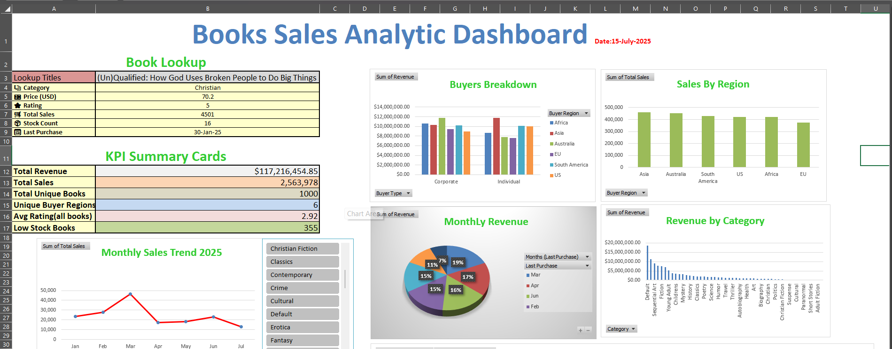
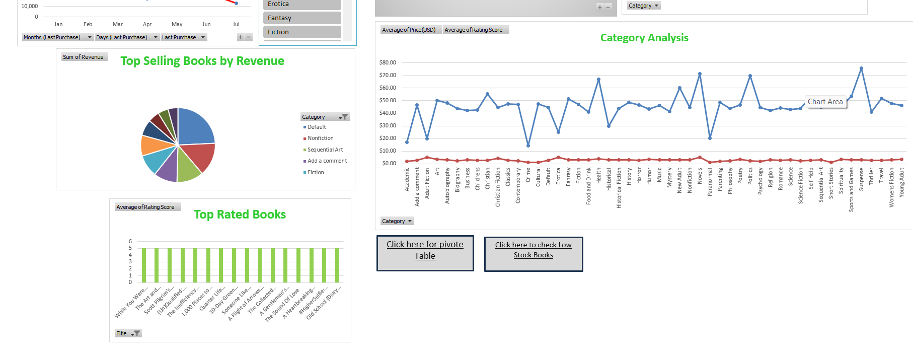
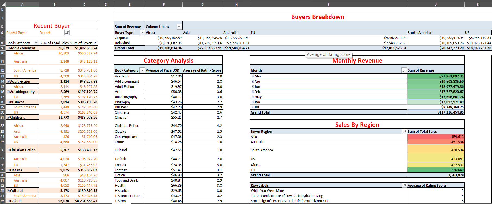

# 📚 Book Sales Dashboard – Web Scraping + Excel Analytics

📊 A full-stack data project: Web scraping book data from an e-commerce site using Python, transforming it in Excel, and building a dynamic, interactive sales dashboard with advanced charts, KPIs, slicers, and formulas.

---

## 📦 Repository Info

**Repo Name:** `book-sales-dashboard`  
**Description:**  
📚 A full data analytics project: Web scraping book data using Python, transforming it in Excel, and building an interactive sales dashboard with PivotTables, slicers, charts, and formulas.

---

## 🧰 Tools & Technologies

| Phase            | Tools Used                        |
|------------------|-----------------------------------|
| Web Scraping     | Python, BeautifulSoup, Requests   |
| Data Storage     | Excel (.xlsx)                     |
| Data Cleaning    | Excel formulas (TEXT, VALUE, etc.)|
| Dashboard        | Excel PivotTables, Charts, Slicers|
| Optional         | Pandas (for preprocessing)        |

---

## 🕸️ Web Scraping Summary

Scraped data from: [books.toscrape.com](http://books.toscrape.com)

Extracted fields:

- 📖 Title  
- 💰 Price (GBP)  
- ⭐ Rating (converted to numeric)  
- 📦 Availability (stock count extracted)  
- 🧾 Category  
- 🔗 Product URL  
- 📄 Description (optional from detail page)

## 📸 Screenshots

### 🧭 Full Dashboard View


---

### 🎯 pivote table


## 📊 Excel Dashboard Features

| Feature               | Description                               |
|------------------------|-------------------------------------------|
| 💰 Total Revenue        | KPI using SUM                             |
| 📚 Total Books          | KPI using COUNTA                          |
| ⭐ Avg Rating            | KPI using AVERAGE                         |
| ⚠️ Low Stock Alert       | COUNTIF + Table for stock < 5             |
| 📈 Monthly Sales Trend  | Line chart based on Last Purchase Date   |
| 🥇 Top Rated Books      | Bar chart (Rating ≥ 4.5)                  |
| 🔝 Top Sellers          | Pivot sorted by Total Sales               |
| 📘 Book Lookup          | Dropdown + XLOOKUP panel                  |
| 🎛 Slicers              | Filter dashboard by Category, Buyer Type |

---

## 📁 Project Structure

```
book-sales-dashboard/
├── data/
│   └── books_detailed_data.xlsx
├── scripts/
│   └── scraper.py
├── dashboard/
│   └── Book_Sales_Dashboard.xlsx
└── README.md
```

---

## 🧠 Key Excel Techniques Used

- `TEXT()` → Extract month from date  
- `XLOOKUP()` → Dynamic Book Info Panel  
- `VALUE()` + `SUBSTITUTE()` → Clean price fields  
- `IFERROR()` → Avoid formula errors  
- `PivotTables` → For summaries  
- `PivotCharts` → For visuals  
- `Slicers` + `Dropdowns` → For filtering  
- `Hyperlinks` → For sheet navigation  

---

## 🚀 How to Use

### Step 1: Scrape Data
Run the Python script to scrape book data:
```
python scripts/scraper.py
```

### Step 2: Analyze in Excel
- Open `dashboard/Book_Sales_Dashboard.xlsx`
- Use slicers, lookup tools, and filters to explore insights

---

## ✨ Sample Use Cases

- Track top-selling genres and books  
- Identify understocked or overperforming products  
- Monitor monthly revenue trends  
- Look up product metrics instantly  
- Present business insights to stakeholders

---

## 📌 Learnings & Takeaways

- Web scraping with BeautifulSoup  
- Feature engineering from messy HTML  
- Data visualization with Excel  
- Business intelligence techniques  
- Excel dashboarding for real-world use

---

## 📎 Bonus Tips

- Use slicers to filter charts by category or rating  
- Export to PDF for reports or presentations  
- Upload to GitHub or LinkedIn as a portfolio project  

---

## 📞 Contact

Feel free to connect or ask questions!

- 💼 https://www.linkedin.com/in/themyui-ningshen-1021b6268/  
- 📧 themyuiningshen2000themyui@gmail.com

---

> Built with 💻 Python + 📊 Excel by Themyui Ningshen
